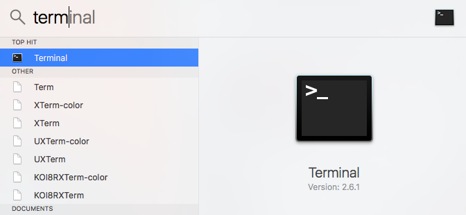
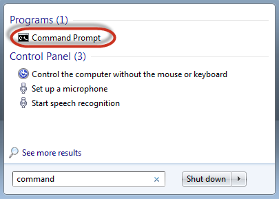
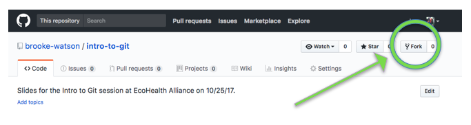
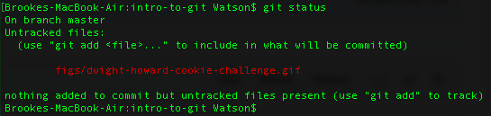
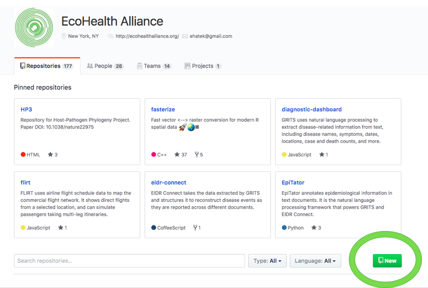
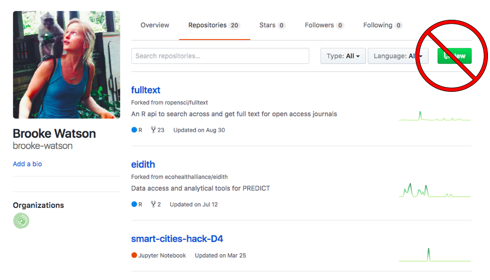

## Why Use Git? 
- For **version control** 
    - track changes in code 
    - revert to old versions when you commit a terrible error
- To avoid this: 

</img>

## Why Use Github?

- To share data and code across teams 

- To track and merge changes in code from multiple collaborators on a project 

<!---
## Barriers to entry 

- You (and your team) already have a versioning system already set up.

- You typically work on analyses (or large chunks of analyses) by yourself. 

- Git co-opts regular words (fork, tree, push, commit) and assigns them *extremely* Git-specific definitions that are tremendously easy to confuse until you get the hang of it. 
--->

## Getting Started: register on Github.com 

- Use your work email address (you can add a personal one later if you like) and register for a *public* (free) account 

- Send your Github username to Noam [ross@ecohealthalliance.org](ross@ecohealthalliance.org) or Toph [allen@ecohealthalliance.org](allen@ecohealthalliance.org) so they can add you to the EHA organizational Github 

- EHA-hosted files can be PRIVATE to the organization. Any data or code that you host on your personal Github.com site will be public. 

## Git terminology 

- `tree`: a directory or folder of files. trees can have multiple branches.
- `branch`: a version of the tree. You can make a new branch if you want to test out changes in a file, but don’t want to alter the original. Changes can then be merged back into the master branch, so you don’t have to keep making new versions of things. 
- `master` or `master branch`: the main version of the tree. Sometimes, you can do an entire project and never leave the master branch.  

## Git terminology 
- `repo` or `repository`: a file directory hosted on Github. This should include everything you need for a project - raw data, code/scripts, intermediate files, etc. 
- `remote`: an external place that holds your tree. For us, the remote will be a path to a Github repo, e.g. [https://github.com/ecohealthalliance/china-niaid](https://github.com/ecohealthalliance/china-niaid)
- `origin`: The default upstream branch. 

## Git verbs  {.smaller .columns-2}

### On the way down: 
- `fork`: copy someone else's remote to your remote 
- `clone`: copy a remote onto your computer 
- `fetch`: update your clone from a remote that already exists
    - note: I barely ever use this 
- `pull`: fetch updates + check them out into your working directory 
    - if there are any conflicts between the remote and your local repository, pull will prompt you to `merge` 

### On the way up:
- `add` or `stage`: get your changes ready to be saved 
- `commit`: save a record to your repository. A commit is basically a super-save.
- `push`: copy that record from your repository (your local computer) to your remote (Github)

 
 

## Git structure 

</img>

- Remote = Github 
- Repository = Git = your local record of `commit`ted saves 
- Workspace = The regular-degular-schmegular files you work on. 
- Index = Honestly, who knows. You have to `git add` before you can `git commit`. Just remember that and keep it moving.

# Practice! 

## First things first: find the command line {.smaller .columns-2}

- In Mac: `cmnd` + `space`, type "terminal", hit Enter

</img>

 

- In Windows: open the start menu and type "cmd" or "command." Click the Command Prompt. 

</img>

## Navigate the command line to where you want it

- In terminal, your prompt will be something like `Brookes-MacBook-Air:Dropbox (EHA) Watson$`
- typing `pwd` at the command line `p`rints your `w`orking `d`irectory 
- `cd <path>` `c`hanges your working `d`irectory to `<path>`
- When you `clone` the git repository, git will download all the files in that repo into your current working directory - basically copying that folder into your home computer 

## Fork someone else's repo 

- This makes a local copy of someone else's project so you can make changes without altering their original. 
- You may not do this often. For example, if you're working by yourself, or if you have contributor privileges to a project, you'll go straight to `cloning`. 
- Forks of private repos *stay private.*
- Fork [https://github.com/brooke-watson/intro-to-git.](https://github.com/brooke-watson/intro-to-git) now. 

## Clone a repo 

- Go to YOUR copy of the repo: [https://github.com/YOUR-USERNAME/intro-to-git](https://github.com/YOUR-USERNAME/intro-to-git). 
- Click the "Clone or Download" button and copy the link. 
- Go back to your command line, and `cd` into the directory where you want this to live. 
- `git clone <paste your link here>`. 
- Your files are there! 
- Check your status with `git status`
    - Should see `"On Branch Master" "Your branch is up-to-date with 'origin/master’"`

## Create a branch 

- Create and checkout a branch to work from: 
	- `git checkout -b <branch_name>` 
	- EX: `git checkout -b myname-branch`

## Make a change and check your status 

- Change anything you want about the directory: 
    - Using the command line 
        - `mkdir oh-boy-a-new-folder` 
        - `touch wow-what-a-new-text-file.txt` 
    - Or, add/edit the folder interactively, the way you normally would. 
        - e.g.: Download your favorite .gif or picture, and move it to `intro-to-git/figs`. 
- `git status` again to see your changes. 

## Make a change and check your status 

You should see something like this: 

 

## Pause because really: what a good wholesome gif.

## Add (stage) changes and look at the differences 

- Add file to changes that you want to “stage”: `git add <filename>` 
	- Sometimes you might use `git add . ` to add ALL untracked files - use with caution!! 
	* can also use `git add *.Rmd` to add all the .Rmd files, for example 
- `git diff —-cached`: (or `git diff` to see **before** you `git add` 

## Commit your changes:
- type `git commit -m "Hey this is my first commit”` 
- don’t leave out the `-m`: just doing `git commit` will open a dreadful text editor that you’ll never escape.
    - Try to write a **useful** message that your collaborators (and/or Future You) might be able to understand

 

## Push changes to Github 
- Check your remote: `git remote -v` (if you started by cloning a repo from GitHub, your origin should already be set)
- Push your changes to the remote server: `git push <remote-name> <your-branch>` 
	- e.g. `git push origin myname-branch`

# Tips for the future 

## Don't accidentally make (y)our private research data public! {.columns-2}

### Start Here 
</img>

  

### Not here
</img>
 
  
... when creating a new repository. 
  
# On finding help 

- When you get stuck, do your Googles.
- If you do things in the right order, 95% of what you want to accomplish can be done with about 6 codes. 
- in order: pull, checkout, 

## Don't forget the Golden Rule

## Resources 

- [https://www.git-tower.com/blog/git-cheat-sheet](https://www.git-tower.com/blog/git-cheat-sheet)

- [http://happygitwithr.com/](http://happygitwithr.com/)

- Noam's reproducibility document: [https://github.com/ecohealthalliance/eha-reproducibility](https://github.com/ecohealthalliance/eha-reproducibility)

- Terminal cheat sheet: 
[https://github.com/0nn0/terminal-mac-cheatsheet](https://github.com/0nn0/terminal-mac-cheatsheet)

- Command line cheat sheet: 
[https://www.git-tower.com/blog/command-line-cheat-sheet/](https://www.git-tower.com/blog/command-line-cheat-sheet/)is 

# Questions? 